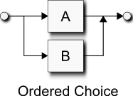

## 解析表达式文法
解析表达式语法(PEG)是EBNF的衍生物，被设计用来表达递归下降的解析器。一个PEG能够直接表达成递归下降解析器。和EBNF相似，PEG是个形式化的文法，用来描述以一个以规则集为单位的形式化语言，用来识别这种使用语言的字符串。和EBNF不同，PEG有一个精确的解释，每个PEG文法只有一个有效的解析树（详见**抽象语法树**）。  
### 序列
按相邻关系表达**序列**，比如在EBNF中：  
``` EBNF
a b
```
上面的PEG表达式的意思是，为了成功，`b`必须跟在`a`之后，语法图如下：  
  
下面是一个例子：  
``` EBNF
'x' digit
```
含义是字符`x`后必须跟一个数字  
> 在`Spirit.Qi`中，我们使用`>>`来表示序列，因为c++不支持相邻；而在`Spirit.Karma`中，使用`<<`代替  

### 选择
在PEG中使用斜杆表达**选择**：  
``` EBNF
a / b
```
> 在`Spirit.Qi`和`Spirit.Karma`中，和EBNF一样，我们使用`|`来表示选择  

上面的表达式读作：尝试匹配`a`，如果`a`匹配成功则成功，否则尝试匹配`b`。这和通常的EBNF的翻译有些不同，它只是简单地匹配`a`**或者**`b`。下面是语法图：  
  
PEG允许选择中有歧义。在上面的表达式中，`a`和`b`都能匹配一个输入字符串。但是，只有第一个成功匹配的选择是有效的。注意，这样只能有一棵有效的解析树。  
### 循环
再次，和EBNF相似，PEG使用正则表达式的**星号**和**加号**循环：  
``` EBNF
a*
a+
```
> `Spirit.Qi`和`Spirit.Karma`使用前缀的**星号**和**加号**，因为在C++中没有后缀的**星号**或**加号**  

以下是语法图：  
  
  
第一个，称作**星号**，能匹配零个或多个主语`a`；第二个，称作**加号**，能匹配一个或多个主语`a`。  
和EBNF不同，PEG的循环是贪婪的，他会尽量匹配它的主语，直到它的主语匹配失败，不管后面跟着什么。下面是一个经典常见的关于EBNF/正则表达式在PEG中会匹配失败例子：  
``` EBNF
alnum* digit
```
在PEG中，`alnum`会吃掉所有的字母-数字字符直到它后面没有更多的此类字符。因此，末尾的`digit`会得不到东西。循环在递归下降代码中被简单地用`for`/`while`循环实现，这使得它非常高效。这是一个明显的优势。在另一方面，熟悉EBNF和regex行为的人将会在这里遇到障碍。PEG提供了一些其他的机制来规避这个问题，我们不久就将看到更多这些其他机制。  
### 差异
在一些情况下，你可能需要限制一些特定的表达式。可以将PEG表达式看作是一个潜在无限字符串集合的匹配。**差异**操作符允许你限制这个集合：  
``` EBNF
a - b
```
这个表达式读作：匹配`a`但是不匹配`b`。
> 在`Spirit.Karma`中，没有差异操作符，因为这个概念在输出生成的上下文中没有意义  

