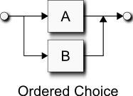
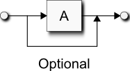

## 语法图
在下一节中，我们将了解解析表达语法(PEG)，一个EBNF的变种。使用语法图将有助于对PEG的理解。语法图是文法的图形化表示，它曾经被Niklaus Wirth在"Pascal用户手册"中被广泛使用。由于他们和流程图相似，语法图很容易被程序员理解。
图和函数的同构性使它们非常适合于表示递归下降解析器，递归下降解析器本质上是互递归函数。  
历史上，PEG只用来为解析器描述语法（所以叫这个名字），在Spirit中，我们也同样为输出生成使用非常相似的记号。在这里描述的所有概念几乎都能在`Spirit.Qi`的解析器和`Spirit.Karma`的生成器中被同样地应用。  
### 元素
所有语法图含有一个进入点和一个退出点，箭头链接所有从进入点到退出点的可能的语法路径  
  
终端点用圆框表示。终端点是原子性的，通常用来表示普通的字符，字符串或者是单词。  
  
非终端点用方框表示，图形可以用命名非终端点来模块化。一个复杂的图形能够分解成非终端点的集合。非终端点同样允许递归（比如一个非终端点能调用它自己）  
  
### 结构
最基础的组合是序列，B跟在A之后  
  
有序选择，我们只之后称他作选择（*alternatives*）。在PEG中，有序选择和选择并不完全一样。PEG允许有歧义的选择，这样一个或多个分支都能匹配成功。在PEG中出现歧义，第一个分支优先被匹配。  
  
可选（零个或一个）  
  
现在，在循环中，我们有**零个或多个**和**一个或多个**  
  
  
注意，这些循环是贪婪的，如果在终止点前有另一个`A`，它将永远失败，因为前面的循环已经穷尽了所有的`A`，然后之后不应该还有`A`了。这个是PEG和通用上下文无关文法(CFG)的区别，这个行为在语法图中很明显，因为他们类似于流程图。  
### 谓词
现在下面的是PEG谓词的语法图版本。这些在传统的语法图中是找不到的。这些是我们为了更好解释PEG而发明的特殊拓展。  
首先，我们介绍一个新元素，他叫谓词  
  
这和流程图中的条件框相似，但是`否`分支不用画出来，它总是表示解析失败  
我们有两种谓词版本，**与谓词**和**非谓词**：  
  
  
**与谓词**尝试断言P，当P成功时即为成功，否则就失败。**非谓词**和**与谓词**相反，它尝试断言P，当P失败时成功，否则为失败。两个版本都是超前的，他们不会消耗任何输入，不管P成功与否。  